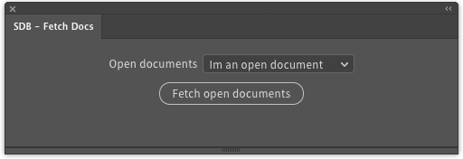
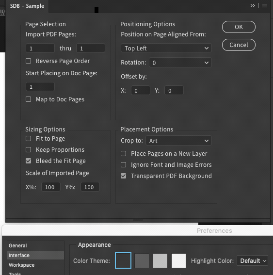

# SDB → CEP samples

[SDB](https://scriptui.joonas.me)'s CEP export is a little hidden. If you can't find the CEP export toggle, check out [this gif](CEP-export-option.gif)

## General SDB Documentation

Documentation lives online at [scriptui.joonas.me/docs](https://scriptui.joonas.me/docs).

 > It's also in the [SDB](https://github.com/joonaspaakko/ScriptUI-Dialog-Builder-Joonas) repo in Github under [build/docs](https://github.com/joonaspaakko/ScriptUI-Dialog-Builder-Joonas/tree/master/build/docs).
 
## Issues Errwhere...

If you have any issues, questions or suggestions, you may want to post those over at [the SDB repo/issues](https://github.com/joonaspaakko/ScriptUI-Dialog-Builder-Joonas/issues).

## SDB.fetch.docs - Sample panel



A simple panel that populates a dropdownlist with the names of all open documents on reload and on button press. It does also activate documents when you select them in the dropdownlist.

#### General tidbits (SDB.fetch.docs)

1. Everything that came from the SDB's CEP export is in the `index.html` file.
2. The button movement is controlled by this little snippet at the top of the `index.html` file:
	```CSS
	[data-item-name="fetchBtn"] > div:active {
		margin-top: 2px;
	}
	```
3. The panel works in: `Indesign`, `Illustrator`and `Photoshop`.
4. The name you'll see in the extensions menu is `SDB - Fetch Docs`

## Theme manager & Interface color example

Just a reminder that [SDB](https://scriptui.joonas.me)'s CEP export now has a theme manager that has to be triggered manually. There's not much to it, but you can read more [here](https://scriptui.joonas.me/docs/CEP-export/thememanager/).


